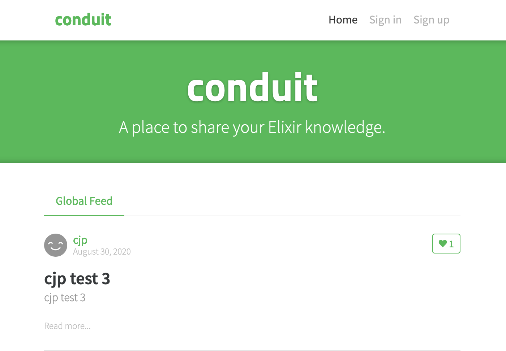
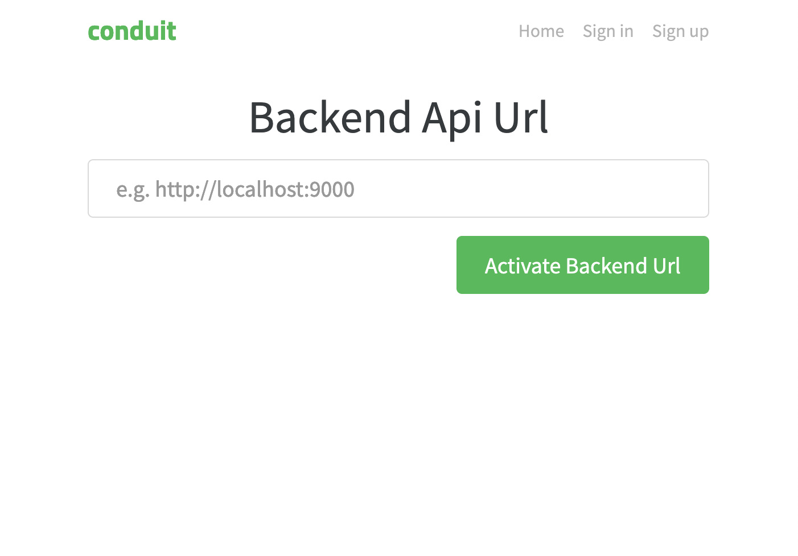

# 

[](http://realworld.io)

> Elixir (Phoenix LiveView) codebase containing real world examples (CRUD, auth, advanced patterns, etc) that adheres to the [RealWorld](https://github.com/gothinkster/realworld-example-apps) spec and API.


### [Demo]()&nbsp;&nbsp;&nbsp;&nbsp;[RealWorld](https://github.com/gothinkster/realworld)


This codebase was created to demonstrate a frontend application built with **Elixir and Phoenix LiveView** including CRUD operations, authentication, routing, pagination, and more.

For more information on how to this works with other frontends/backends, head over to the [RealWorld](https://github.com/gothinkster/realworld) repo.


# How it works

Todo:
> Describe the general architecture of your app here

## Installing / Getting started

To run this project, you will need to install the following dependencies on your system:

* [Elixir](https://elixir-lang.org/install.html)
* [Phoenix](https://hexdocs.pm/phoenix/installation.html)

To get started, run the following commands in your project folder.

Clone the repository:

```sh
git clone https://github.com/razuf/elixir-phoenix-liveview-realworld.git
cd elixir-phoenix-liveview-realworld
```

Install the dependencies:

```sh
mix deps.get
```

Build and run a local development server:

```sh
mix phx.server
```


## Open in your browser

This is a frontend project, you can go to http://localhost:4000 and see this aplication. 

# 

This is connected to the standard [Conduit](https://demo.realworld.io/#/) backend `https://conduit.productionready.io/api`.

In order to connect other [Conduit](https://demo.realworld.io/#/) backends you can download and setup one of the [backend projects](https://demo.realworld.io/#/) and set it up as api for this app. Typically this can be done by finding the localhost url and port e.g. `localhost:9000` and then put it into:

http://localhost:4000/backend_api_url 

# 


## Tests

It's on my list to improve. Testing is one of my favorite feature in LiveView. I'll do it asap.

I wrote some basic tests. 
- for redirects when require authenticated user
- for redirect if user is authenticated
- and a first click test: Sign in from home

To run the tests for this project, you don't need to install any additional tools, simply run in your terminal:

```shell
mix test
```

result:

```elixir
....

Finished in 2.1 seconds
6 tests, 0 failures
```
It maybe needs some seconds because of fully handle a start with a connection to the backend incl. loading of the last 5 articles from the backend.

## Documentation

Needs to be done... 

I'm writing a blog post inside Conduit. ;-) You can read it [here](https://realworld.gigalixirapp.com/article/frontend-with-elixir-phoenix-liveview-c9s0oh).

## Licensing

MIT © Ralph Zühlsdorf